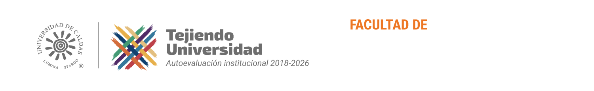

# Bienvenida al curso

```{raw} html
<div style="background-color:#212529; padding: 1.5rem 1.25rem; border-radius: 0.75rem; text-align:center; margin: 1.5rem 0 2rem 0;">
  
</div>
```

## Introducción a la Informática · 40G8F · 2026-2

Este **no** es un curso de "aprender a usar Word". Es un curso para que, sin importar si estudias biología, derecho, artes, deporte o cualquier otra cosa, salgas sabiendo **usar la inteligencia artificial como un profesional**: crear tu propia página web, montar un sistema de gestión sin programar, chatear con tus PDFs, analizar datos, construir agentes que trabajen por ti y automatizar lo aburrido.

```{admonition} La regla del curso 🧰
:class: tip
**Cada sesión conocemos y usamos una herramienta de IA distinta.** Siempre haciendo algo real, aplicado a *tu* carrera, y siempre saliendo de clase con algo construido.
```

## El equipo!! 🦾

::::{grid}
:gutter: 2

:::{grid-item-card} Johan 🍍
:class-body: text-center
:class-header: bg-light text-center
```{image} _static/images/jpd.png
:height: 100
:class: rounded
```
^^^
```{only} html
[](mailto:johan.pina@ucaldas.edu.co)
```
:::
::::

---

::::{grid} 2
:gutter: 2

:::{grid-item}
:class: sd-fs-7

**Mg. Johan Sebastián Piña Duran**

* Ingeniero Electrónico - Universidad Autónoma de Manizales
* Ingeniero Biomédico - Universidad Autónoma de Manizales
* Magister en Bioinformática y Biología Computacional - Universidad Autónoma de Manizales
* Especialista en Deep Learning - DeepLearning.AI

```{only} html
[](https://github.com/BioAITeamLearning)
[](https://scholar.google.com/citations?user=XLIIhSQAAAAJ&hl=es)
```

:::
::::

---

## Objetivos del curso

**General (PIIA):** fomentar una visión moderna frente al uso y aprovechamiento de las TIC, que sirva de apoyo en la resolución de problemas mediante un uso consciente del computador como herramienta de trabajo.

**En la práctica, al terminar el curso vas a poder:**

* Usar asistentes de IA (Gemini, NotebookLM, Claude, ChatGPT) con criterio: buenos prompts, verificación de fuentes y ética.
* Convertir tus PDFs, artículos y apuntes en podcasts, mapas mentales, quices y un bot que responde preguntas.
* Publicar tu **propia página web / portafolio** sin saber programar (y con ayuda de IA si quieres ir más allá).
* Montar un **sistema de gestión** (inventario, casos, pacientes, atletas, obras) desde una hoja de cálculo.
* Obtener, limpiar, analizar y **visualizar datos** con IA y contar una historia con ellos.
* Entender cómo funciona la IA por dentro, **crear tus propios agentes** y **automatizar** tareas repetitivas.

---

## Contenido del curso

::::{grid} 1 1 2 3
:class-container: text-center
:gutter: 3

:::{grid-item-card}
:link: Unidad1
:link-type: doc
:class-header: bg-light
:class-body: text-start

**Unidad 1 🧰: TIC y tu kit de IA**
^^^
* Hardware, software y bienestar digital
* El kit de superpoderes: Gemini, NotebookLM, Claude
* Seguridad y organización de tu vida digital
* Tu primer análisis de una carpeta de documentos
:::

:::{grid-item-card}
:link: Unidad2
:link-type: doc
:class-header: bg-light
:class-body: text-start

**Unidad 2 🧠: Sociedad de la información**
^^^
* Prompts de nivel pro y tu primer asistente (Gem)
* Investigar con IA: Deep Research, Scholar, bases de datos
* Verificar, citar, derechos de autor
* Ética, deepfakes y huella ambiental
:::

:::{grid-item-card}
:link: Unidad3
:link-type: doc
:class-header: bg-light
:class-body: text-start

**Unidad 3 🌐: Crear cosas con IA**
^^^
* Tu página web / portafolio
* Infografías, presentaciones, video y audio con IA
* Sistemas de gestión sin código (AppSheet)
* Tu primera automatización
:::

:::{grid-item-card}
:link: Unidad4
:link-type: doc
:class-header: bg-light
:class-body: text-start

**Unidad 4 📊: Datos**
^^^
* Obtener y limpiar datos con IA
* Análisis en lenguaje natural (Colab + Gemini)
* Estadística intuitiva con simuladores
* Dashboards y data storytelling
:::

:::{grid-item-card}
:link: Unidad5
:link-type: doc
:class-header: bg-light
:class-body: text-start

**Unidad 5 🤖: IA profesional**
^^^
* Cómo funciona la IA (jugando)
* Agentes: crearlos y correrlos
* Automatizaciones y bots que chatean con PDFs
* Demo Day
:::

:::{grid-item-card}
:link: ProyectoFinal
:link-type: doc
:class-header: bg-light
:class-body: text-start

**Proyecto final 🚀: Mi kit de IA profesional**
^^^
* Un problema real de tu carrera
* Resuelto con lo construido en el curso
* Presentado en el Demo Day
:::

::::

---

## Reglas de Juego 🕹️📏

* Cada sesión: **una herramienta de IA nueva**, una actividad práctica y un entregable pequeño.
* Todo lo que construyes se va a tu **portafolio web** (lo creamos en la Sesión 7).
* Trae tu computador (o usa los del laboratorio) y **documentos reales de tu carrera**: PDFs, apuntes, datos.
* La IA es tu copiloto, no tu reemplazo: siempre decimos **qué herramienta usamos y qué verificamos**.

### Evaluación

| Corte | Sesiones | Peso | Qué se evalúa |
|---|---|---|---|
| **Corte 1** | 1 – 6 | 30% | Portafolio de actividades de clase (NotebookLM, Gem, investigación verificada) + taller de ética |
| **Corte 2** | 7 – 12 | 35% | Página web publicada + sistema de gestión + dashboard con historia de datos |
| **Corte 3** | 13 – 16 | 35% | Agente o automatización funcionando + proyecto final en el Demo Day |

```{note}
Nota aprobatoria 3,0 · No habilitable · Se reprueba con 7 faltas no justificadas (15%) o 12 justificadas + no justificadas (25%). El detalle de cómo se vive cada sesión y cómo se califica cada entregable está en {doc}`Metodologia`.
```

---

## Bibliografía

Además de los libros del PIIA, este curso vive de recursos abiertos y actualizados:

* Phoenix, J. & Taylor, M. (2025). *Prompt engineering para inteligencia artificial generativa*. Marcombo. [eLibro UCaldas](https://elibro.bd.ucaldas.edu.co/es/lc/ucaldas/titulos/281774)
* Nilsson, N. J. (2016). *Inteligencia artificial: una nueva síntesis*. McGraw-Hill.
* UNESCO (2023). *Global citizenship education in the digital age: Teacher guidelines*. [Enlace](https://www.unesco.org/en/articles/global-citizenship-education-digital-age-teacher-guidelines)
* MINTIC (2021). *Estrategia de transformación digital para Colombia*. [PDF](https://www.mintic.gov.co/portal/715/articles-334120_recurso_1.pdf)
* Google. *Prompting guide 101* y *Gemini for Education*. [Enlace](https://workspace.google.com/resources/ai/writing-effective-prompts/)
* Anthropic. *Prompt engineering overview*. [Enlace](https://docs.anthropic.com/en/docs/build-with-claude/prompt-engineering/overview)
* Bases de datos de la Universidad de Caldas: [biblioteca.ucaldas.edu.co](https://biblioteca.ucaldas.edu.co)

---

## ¿Qué vamos a ver durante el curso?

```{tableofcontents}
```
